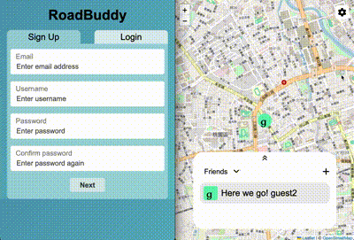
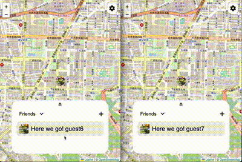
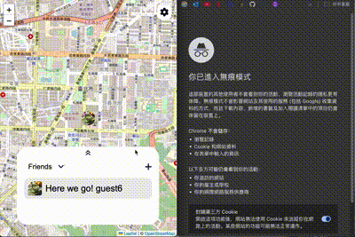

# RoadBuddy
RoadBuddy is a web app designed for group travel, allowing users to track each other's real-time locations and display them on individual maps. This helps users stay updated on each other's progress and prevents group members from falling behind or losing track of the convoy.

RoadBuddy uses the Python Flask framework to build the backend server and MySQL to create databases for members, teams, and friends, etc. The app establishes a RESTful API via the HTTP protocol to update backend data. 

The real-time location update feature utilizes the WebSocket protocol for bi-directional data transmission between the client and server.

For client-side data storage, the app leverages AWS cloud services, with the MySQL database hosted on AWS RDS and client images stored in AWS S3. CloudFront is used to optimize data retrieval speed. 

The front end is rendered using HTML, CSS, and JavaScript.

## Table of Content
- Features
- Demo
- Installation
- Usage
- Technologies Used
- Contact 

## Features
- Real-time interaction:  trace users position and update to each other in traveling.
- Map system: show your own position and partners position when traveling.
- Team system: create teams for traveling, invite friends to join in and request to join team.
- Friend system: make friend with other users and send request message to offline users. 
- User authentication : sign up and login.
- User configuration : modify username, password and avatar.

## Demo


## Installation
### Prerequisites
1. python 3.10.4
2. boto3 1.28.70
3. Flask 3.0.3
4. Flask_SocketIO 5.3.6
5. mysql-connector-python 8.1.0
6. PyJWT 2.8.0
7. python-dotenv 1.0.1
8. Werkzeug 3.0.4


### Clone the repository
```bash
git clone https://github.com/KJeiii/RoadBuddy.git
```

### Install dependencies 
```bash
cd ./RoadBuddy
pip3 install -r ./requirements.txt 
```

### Create .env file and set environment variables(/RoadBuddy/.env)
```
# mysql parameters; the app utilize AWS RDS service
db_host= <your mysql IP>
db_port=<your mysql port>
db_user=<your mysql user>
db_password=<your mysql password>
database=<your mysql database>

# jwt secret key for PyJWT module encoding and decoding
jwtsecret=<your jwtsecret>

# AWS authentication
aws_access_key_id=<your access_key_id>
aws_secret_access_key=<your secret_access_key>

# AWS S3 IP 
RDS_domain_name=<your S3 IP>
```

### Run the app
```bash
python3 app.py
```

## Usage
- Sign up for an account and login.


- Search your friend’s name and send requests for making new friends; if the friend is offline, the requests would turn to be messages and receivers would get notification as they get online.




- Create your own team, click the team you created, invite your friends to join and start the trip.


- If you’ve not joined team yet, click the team you ever joined and send the request to team owner; you would join the trip if team owner accepts your request.


- Leave the team if the trip finished or you don’t need to trace anymore.


- Modify your own information, for example: username, password and avatar.


- Logout after finishing the web app.


## Technologies Used
- Backend: Python, Flask
- Database: AWS RDS (MySQL)
- API: RESTful API
- Real-time interaction: WebSocket protocol 
- Cloud service (AWS): EC2, S3(avatar storage) and CloudFront
- Authentication: JWT
- Frontend: HTML, CSS, Javascript, Leaflet and Socket.IO, 

## Contact
- Email: pleaemailtokj@gmail.com
- GitHub: [KJeiii](https://github.com/kjeiii)
- LinkedIn: [Kai-Chieh Chang](https://www.linkedin.com/in/kai-chieh-chang-張凱捷-a10221b9)
